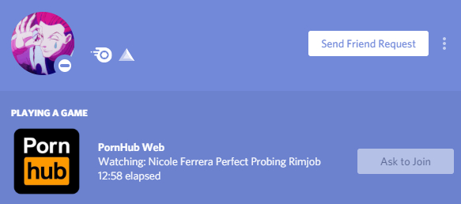

# Pornhub Discord RPC

The most useless project ever... <br>
This is a node project which randomly picks a video based on the categories it's provided and displays it on your discord status.



------

## Packages used

* [Pornhub.js](https://github.com/pionxzh/pornhub.js) 
* [Discord-RPC](https://github.com/discordjs/RPC) 

## Table of contents

* [Install](#Install)
* [Setup](#Setup)
* [Usage](#Usage)

------

## Install

1. **Install NodeJS and Git**. To start off, you will need to download <a href="https://git-scm.com/downloads" target="_blank"><strong>Git</strong></a> and <a href="https://nodejs.org/en/" target="_blank"><strong>NodeJS</strong></a>. This will be required to make the rpc actually work.

2. **Install the forever package**. After installing NodeJS and Git, you can install the forever package by opening up a terminal and running the following command `npm install -g forever`. Forever will be used to keep the rpc script running forever.

3. **Install the core dependencies**. You can do this by opening up a terminal and running the following commands.

    ```bash
    $ git clone https://github.com/photosensory/pornhub-discord-rpc.git
    $ cd discord-rpc-pornhub
    $ npm install
    $ npm install -D dotenv
    ```

## Setup

1. Go to the [Discord Developer Portal](https://discord.com/developers) </br>

2. **Create an application.** You can create an application in the Discord Developer Portal by clicking the `Create Application` button, which should be located around the top right of your screen.
    - I recommend naming the application `Pornhub Web`.
    - You also want to make a note your "CLIENT ID" under the OAuth2 Tab.

3. You will need to upload the PornHub logo called `ph_icon` under the rich presence assets *(Must be 512x512px Minimum)*. You can click [here](assets/ph_icon.png) to download the provided image.</br>

4. Rename `.env.example` to `.env` and input your **"CLIENT ID"** you took note of in place of ***"client_id_here"***. </br>

5. Edit `config.js` via adding or removing search terms in the following format: </br>

    ```js
    module.exports = {
        "searchTerms": [
            "Pussy",
            "Blowjob",
            "Sex",
            "Rimjob",
            "Milf"
        ]
    }
    ```

6. Now start the rpc script via `npm run start` and it should work. </br>
    - You can stop the rpc script by running the following command: `npm run stop`

## Usage

To start the RPC script:

```bash
$ npm run start
```

To stop the RPC script:

```bash
$ npm run stop
```
